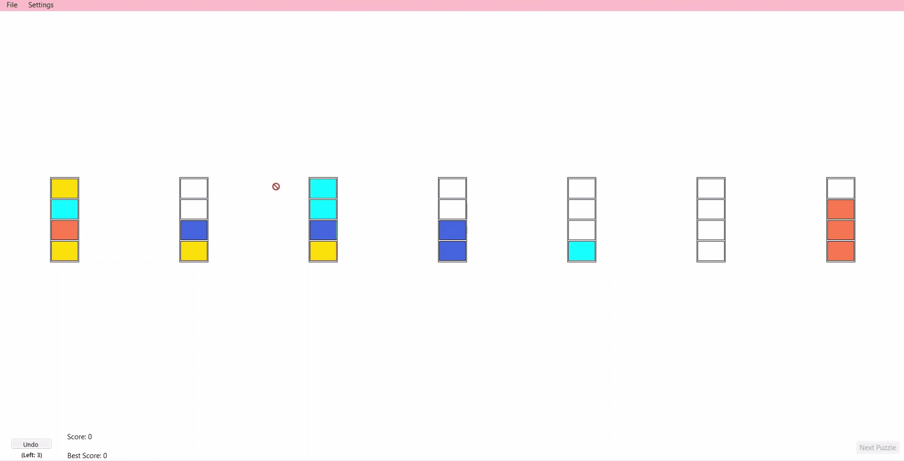

# Potion Master


A Windows Forms desktop application built with C# and .NET for interactive potion mixing, vial visualization, and liquid volume control.

---

## Demonstration



---

## Key Features

In this application, you can:

* **Manage potion vials**: Interact with **custom vial controls** to view, fill, and pour liquids between containers.
* **Mix ingredients**: Experiment with **color blending** and liquid volume dynamics in real time.
* **Configure settings**: Customize **vial parameters** and preferences through the settings window.

---

## Requirements & Setup

### Prerequisites
* **.NET 6.0 SDK** or higher
* **Windows OS** (WinForms requirement)
* **Visual Studio 2022** / **JetBrains Rider** / **VS Code**

### Building and Running

1. **Clone the repository**:
   ```pwsh
   git clone https://github.com/uasuna2022/PotionMaster.git
   cd PotionMaster
   ```

2. **Build the solution**:
   ```pwsh
   dotnet build PotionMasterNew.sln
   ```

3. **Run the application**:
   ```pwsh
   dotnet run --project PotionMasterNew/PotionMasterNew.csproj
   ```
